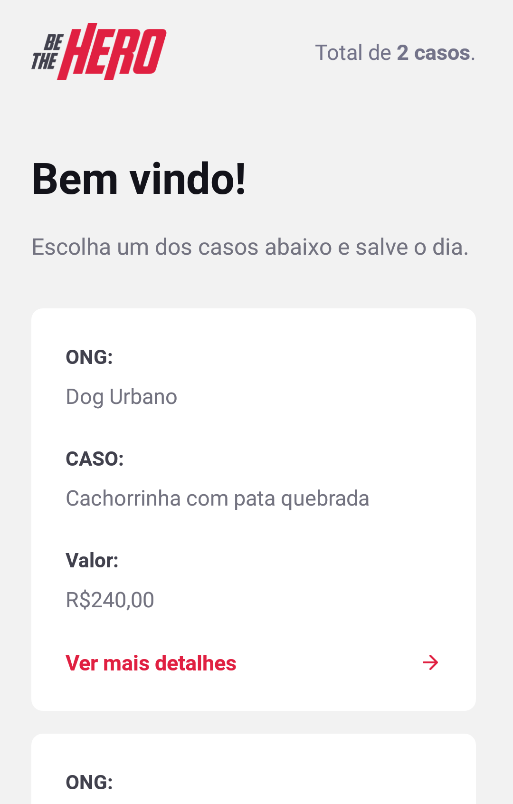

# App Semana OmniStack 11

Aplicação desenvolvida em react junto com a equipe da Rocketseat.

Foi um curso online onde pude desenvolver e aprender bastante sobre essa linguagem poderosa e muito agradavel de se trabalhar.

As telas da aplicação:

# Tela de inicialização do aplicativo:

  

# Tela Principal

  

# Tela com detalhe dos casos

  

# Enviar e-mail

  

